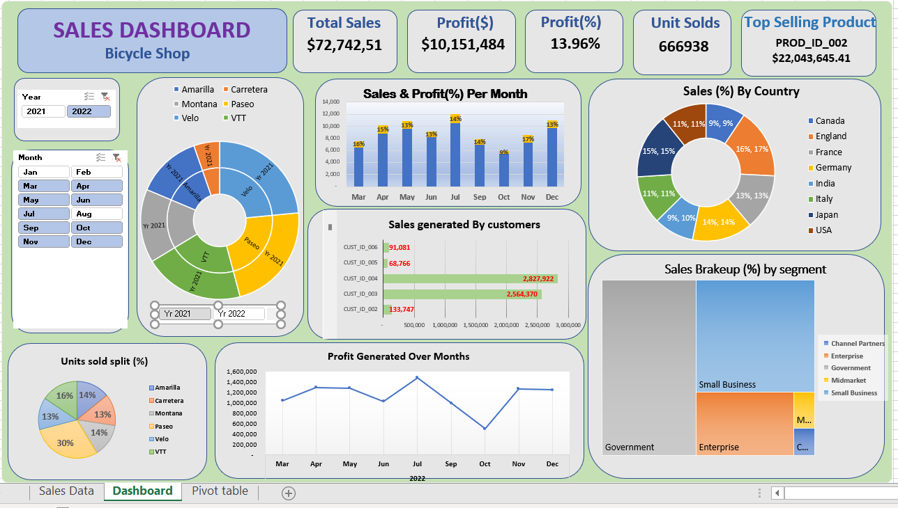

# 📊 BiCycle Sales Dashboard - Excel Project  

## Project Overview  
This Excel-based Sales Dashboard provides an interactive visualization of sales performance, allowing users to analyze key metrics such as total sales, profit, customer trends, and product-wise performance using pivot tables, charts, and slicers.  

## 📷 Excel Dashboard  
  

## Key Features  
- **Dynamic Data Visualization**: Used pivot charts and conditional formatting to highlight trends.  
- **Interactive Filters & Slicers**: Enabled filtering by year, month, and product category.  
- **Advanced Calculations**: Used formulas like SUMIFS, VLOOKUP, and percentage calculations for deeper insights.  

## Step-by-Step Development  

### 1️⃣ Data Collection & Preparation  
- Structured sales data into an Excel Table for better management.  
- Cleaned and formatted the dataset for consistency.  
- Created calculated fields for profit percentage, total revenue, and category-wise contributions.  

### 2️⃣ Building the Dashboard Layout  
- Designed a clear, KPI-driven layout displaying **Total Sales, Profit, and Units Sold**.  
- Organized visual elements into separate sections for easy readability.  

### 3️⃣ Implementing Visualizations  
- **Bar Charts**: Used to display monthly sales and profit trends.  
- **Pie Charts**: Showed sales percentage by country and product category.  
- **Sunburst Chart**: Visualized sales distribution across different categories over time.  
- **Treemap Chart**: Highlighted customer segment-wise contributions.  

### 4️⃣ Adding Interactivity  
- **Slicers** for filtering by Year, Month, and Product Category.  
- **Conditional Formatting** to highlight top-selling products and high-revenue customers.  

### 5️⃣ Creating Measures & Calculations  
- Used Excel formulas like:  
  - **SUMIFS** → For conditional aggregation.  
  - **VLOOKUP/XLOOKUP** → For mapping and retrieving sales data.  
  - **Percentage Calculations** → To analyze profit margins and category performance.  

## Technologies & Skills Used  
- **Excel Tables & Pivot Tables** → Data structuring & aggregation.  
- **Pivot Charts & Slicers** → Interactive visualization.  
- **Conditional Formatting** → Highlighting key insights.  
- **Excel Formulas** → Data manipulation and dynamic calculations.  

This dashboard allows users to track and analyze sales trends efficiently, making it a powerful tool for business decision-making. 🚀  

